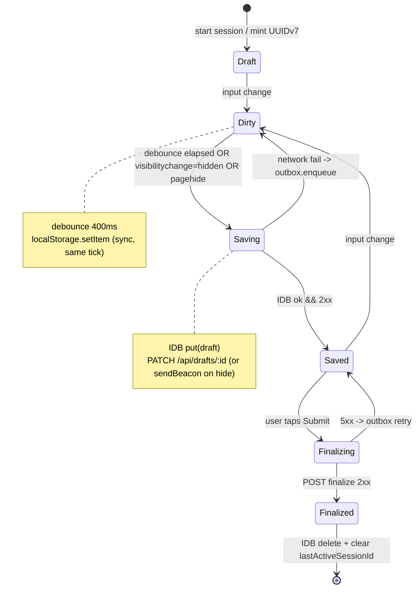
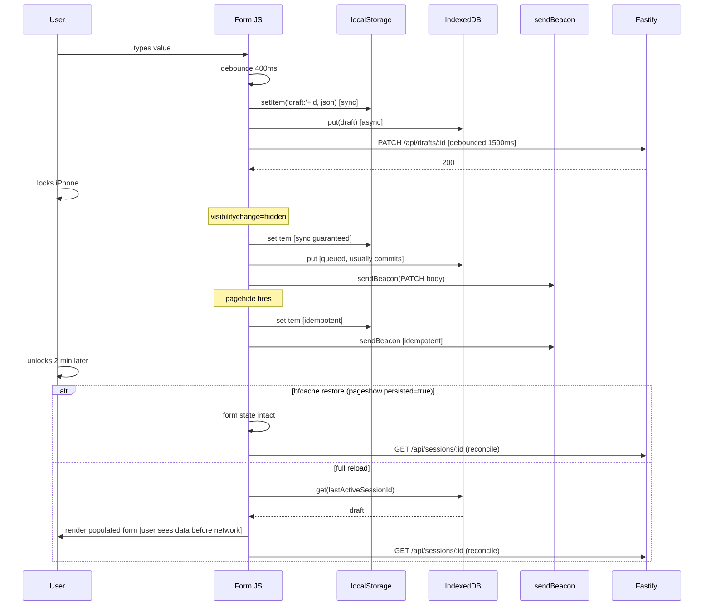

Here is a draft plan to refine:

# Workouts Tracker — Implementation Plan

## Context

Greenfield personal workout tracker for a single user, deployed at
`workouts.cmon1975.com` on an existing Digital Ocean droplet that already
runs nginx + certbot for other subdomains. The repo currently contains
only `CLAUDE.md`, `README.md`, and `.gitignore` — no code.

The **load-bearing requirement** is that an in-progress session on an
iPhone survives the tab being backgrounded and the phone locked for
several minutes. Past implementations have lost data here. Everything
else in the plan is arranged around making that requirement bulletproof.

Stack is locked (per `CLAUDE.md`): Fastify + better-sqlite3 server,
vanilla HTML/CSS/JS client, no bundler, no framework, one `package.json`,
deploy via `git pull && systemctl restart workouts`.

---

## Design decisions (opinionated)

| Decision              | Choice                                                                             | Rationale                                                                                                                                              |
| --------------------- | ---------------------------------------------------------------------------------- | ------------------------------------------------------------------------------------------------------------------------------------------------------ |
| Template shape        | One schema. N-sets-of-one-metric = 1-column degenerate of row×column.              | Single renderer, single save path, no forked code.                                                                                                     |
| Values storage        | Tall/narrow `session_values` (one row per cell).                                   | SQL-queryable for later charts; partial writes natural; JSON blobs would force a migration the first time you want `MAX(value_num)`.                   |
| Session id            | Client-minted **UUIDv7** (string PK).                                              | Offline-start works; idempotent PATCH/finalize; id is the IDB key.                                                                                     |
| Draft vs. finalized   | Single `sessions` table with nullable `finalized_at`.                              | Splitting into `session_drafts`/`sessions` always ends in a migration when you want to edit a finalized session.                                       |
| Local store           | **IDB (source of truth) + localStorage (shadow)**.                                 | IDB survives iOS memory pressure better than localStorage; localStorage gives a synchronous same-tick fallback when the tab is frozen mid-transaction. |
| Network flush on hide | `navigator.sendBeacon` from `pagehide`.                                            | `beforeunload` is unreliable on iOS Safari; sendBeacon is the only network call guaranteed to leave during teardown.                                   |
| Conflict resolution   | LWW by `(client_version, updated_at)`.                                             | Client-side monotonic `client_version` is skew-proof; `updated_at` is only a tiebreaker.                                                               |
| Auth                  | Single bcrypt-hashed password in env, signed cookie via `@fastify/secure-session`. | One user, no accounts table, no reset flow.                                                                                                            |

---

## Directory layout

```
workouts/
├── package.json                 # one, no build step
├── package-lock.json
├── .env.example                 # PORT, SESSION_SECRET, PASSWORD_HASH, DB_PATH
├── .gitignore                   # fix typo + add *.db-wal, *.db-shm
├── README.md
├── CLAUDE.md
├── server/
│   ├── index.js                 # fastify bootstrap, plugin wiring
│   ├── db.js                    # better-sqlite3 connection, pragmas, migrations
│   ├── migrations/
│   │   └── 001_init.sql         # DDL below
│   ├── auth.js                  # login/logout, bcrypt compare, cookie
│   └── routes/
│       ├── templates.js         # GET/POST/PATCH
│       ├── drafts.js            # PATCH /api/drafts/:id (UPSERT, LWW)
│       └── sessions.js          # GET list/one, POST finalize, GET history
├── public/                      # served statically under /
│   ├── index.html               # login + SPA shell
│   ├── manifest.webmanifest     # cheap, iOS home-screen friendly
│   ├── css/app.css
│   ├── js/
│   │   ├── app.js               # router + top-level init
│   │   ├── api.js               # fetch wrapper, CSRF header if needed
│   │   ├── idb.js               # IDB wrapper (drafts, meta, outbox stores)
│   │   ├── persistence.js       # shadow-write, pagehide flush, outbox drain
│   │   ├── session-state.js     # state machine + debounced saver
│   │   ├── renderer.js          # render form from template_columns
│   │   └── uuidv7.js            # ~20-line impl
│   └── icons/                   # 180x180 apple-touch-icon + manifest icons
├── scripts/
│   └── hash-password.js         # stdin → bcrypt → stdout, paste into .env
└── deploy/
    ├── workouts.service         # systemd unit
    ├── nginx-workouts.conf      # server block
    └── logrotate-workouts       # /etc/logrotate.d fragment
```

---

## Data model (SQLite DDL)

```sql
PRAGMA foreign_keys = ON;
PRAGMA journal_mode = WAL;
PRAGMA synchronous = NORMAL;

CREATE TABLE templates (
  id           INTEGER PRIMARY KEY,
  name         TEXT    NOT NULL UNIQUE,
  created_at   INTEGER NOT NULL,            -- epoch ms
  archived_at  INTEGER                       -- soft delete
);

CREATE TABLE template_columns (
  id           INTEGER PRIMARY KEY,
  template_id  INTEGER NOT NULL REFERENCES templates(id) ON DELETE CASCADE,
  name         TEXT    NOT NULL,             -- "reps", "Time", "KPH"
  unit         TEXT,                          -- "pounds", "min", nullable
  position     INTEGER NOT NULL,              -- 0-based display order
  value_type   TEXT    NOT NULL DEFAULT 'number'
                       CHECK (value_type IN ('number','text','duration'))
);
CREATE UNIQUE INDEX ux_template_columns_tpl_pos  ON template_columns(template_id, position);
CREATE UNIQUE INDEX ux_template_columns_tpl_name ON template_columns(template_id, name);

-- default_rows lets "Bicep Curls / 4 sets" pre-materialize 4 empty rows;
-- "Walk" sets it to 1 and the UI shows an "add row" button.
CREATE TABLE template_defaults (
  template_id  INTEGER PRIMARY KEY REFERENCES templates(id) ON DELETE CASCADE,
  default_rows INTEGER NOT NULL DEFAULT 1,
  rows_fixed   INTEGER NOT NULL DEFAULT 0    -- 1 = sets-style, 0 = add-row style
);

CREATE TABLE sessions (
  id             TEXT    PRIMARY KEY,         -- client-minted UUIDv7
  template_id    INTEGER NOT NULL REFERENCES templates(id) ON DELETE RESTRICT,
  started_at     INTEGER NOT NULL,
  updated_at     INTEGER NOT NULL,
  finalized_at   INTEGER,                     -- NULL = draft
  client_version INTEGER NOT NULL DEFAULT 0,  -- LWW primary key
  notes          TEXT
);
CREATE INDEX ix_sessions_template ON sessions(template_id, started_at DESC);
CREATE INDEX ix_sessions_drafts   ON sessions(finalized_at) WHERE finalized_at IS NULL;

CREATE TABLE session_values (
  session_id   TEXT    NOT NULL REFERENCES sessions(id) ON DELETE CASCADE,
  row_index    INTEGER NOT NULL,              -- 0-based
  column_id    INTEGER NOT NULL REFERENCES template_columns(id) ON DELETE RESTRICT,
  value_num    REAL,
  value_text   TEXT,
  PRIMARY KEY (session_id, row_index, column_id)
) WITHOUT ROWID;
CREATE INDEX ix_session_values_col ON session_values(column_id, value_num);
```

Notes:
- `template_columns.ON DELETE RESTRICT` from `session_values` means you
  can't hard-delete a column that has historical data. Soft delete only.
- `WITHOUT ROWID` on `session_values` because the composite PK IS the
  access pattern and it saves a btree level.
- Partial index on drafts makes "resume unfinished" O(log n).

Seed row for M1:

```sql
INSERT INTO templates (name, created_at) VALUES ('Bicep Curls', strftime('%s','now')*1000);
INSERT INTO template_columns (template_id, name, unit, position, value_type)
  VALUES (last_insert_rowid(), 'reps', 'pounds', 0, 'number');
INSERT INTO template_defaults (template_id, default_rows, rows_fixed)
  VALUES (last_insert_rowid(), 4, 1);
```

---

## API surface

All routes except `POST /api/login` require a valid session cookie;
failure returns 401 JSON. All bodies are JSON; timestamps are epoch ms.

| Method | Path                                | Body / Query                                                                    | Response                                                                                                               |
| ------ | ----------------------------------- | ------------------------------------------------------------------------------- | ---------------------------------------------------------------------------------------------------------------------- |
| POST   | `/api/login`                        | `{password}`                                                                    | 204 + Set-Cookie; 401 on mismatch                                                                                      |
| POST   | `/api/logout`                       | —                                                                               | 204, clears cookie                                                                                                     |
| GET    | `/api/templates`                    | —                                                                               | `[{id,name,columns:[{id,name,unit,position,value_type}],default_rows,rows_fixed}]`                                     |
| POST   | `/api/templates`                    | `{name, columns:[{name,unit?,value_type?}], default_rows, rows_fixed}`          | 201 + full template object                                                                                             |
| PATCH  | `/api/templates/:id`                | partial                                                                         | 200 + updated object (soft-delete via `archived_at`)                                                                   |
| GET    | `/api/sessions?template_id=&limit=` | —                                                                               | `[{id, started_at, finalized_at, values:[{row_index,column_id,value_num,value_text}]}]`                                |
| GET    | `/api/sessions/:id`                 | —                                                                               | single session with values                                                                                             |
| PATCH  | `/api/drafts/:id`                   | `{id, template_id, started_at, updated_at, client_version, notes?, values:[…]}` | 200 `{server_version, updated_at}`. UPSERT; keeps `MAX(client_version)`; replaces values. Idempotent.                  |
| POST   | `/api/sessions/:id/finalize`        | `{client_version}`                                                              | 200 `{finalized_at}`. Idempotent — second call is no-op if already finalized with same version.                        |
| GET    | `/api/sessions/:id/previous`        | —                                                                               | `{values:[…]}` values from the previous finalized session of the same template, for benchmark display. `null` if none. |

Notes:
- Draft PATCH accepts the **whole** draft, not a partial — simpler and
  fine at ~a few KB per request.
- CSRF: since same-origin and cookie is `SameSite=Lax`, we don't need a
  token. Login form uses a normal fetch; no third-party embeds expected.
- All mutating endpoints behind `@fastify/rate-limit` (bucket per IP,
  generous — single-user).

---

## State machine (session entry screen)



## Local ↔ server sync (hide/flush path)



---

## Persistence — code-level detail

### IDB wrapper (`public/js/idb.js`)

Three object stores:
- `drafts` — keyPath `id`, index `byTemplate`.
- `meta` — keyPath `k`; holds `{k:'lastActiveSessionId', v:'...'}`.
- `outbox` — `{id:autoIncrement}`, holds failed mutations.

```js
const DB_NAME = 'workouts', DB_VER = 1;
let _db;
export function openDB() {
  if (_db) return Promise.resolve(_db);
  return new Promise((res, rej) => {
    const r = indexedDB.open(DB_NAME, DB_VER);
    r.onupgradeneeded = () => {
      const db = r.result;
      const drafts = db.createObjectStore('drafts', { keyPath: 'id' });
      drafts.createIndex('byTemplate', 'templateId');
      db.createObjectStore('meta',   { keyPath: 'k' });
      db.createObjectStore('outbox', { keyPath: 'id', autoIncrement: true });
    };
    r.onsuccess = () => { _db = r.result; res(_db); };
    r.onerror   = () => rej(r.error);
    r.onblocked = () => console.warn('IDB blocked — close other tabs');
  });
}
export async function putDraft(draft) {
  const db = await openDB();
  return new Promise((res, rej) => {
    const tx = db.transaction(['drafts','meta'], 'readwrite');
    tx.objectStore('drafts').put(draft);
    tx.objectStore('meta').put({ k:'lastActiveSessionId', v:draft.id });
    tx.oncomplete = () => res();
    tx.onerror    = () => rej(tx.error);
  });
}
```

### pagehide flush (`public/js/persistence.js`)

The three-layer flush. Any one layer recovering the draft is enough.

```js
export function installHideFlush(getDraft) {
  const flush = () => {
    const d = getDraft();
    if (!d) return;
    const json = JSON.stringify(d);
    try { localStorage.setItem('draft:' + d.id, json); } catch(_) {}    // sync
    try { putDraft(d); } catch(_) {}                                     // queued
    try {
      const blob = new Blob([json], { type: 'application/json' });
      navigator.sendBeacon('/api/drafts/' + d.id, blob);                 // fire-and-forget
    } catch(_) {}
  };
  document.addEventListener('visibilitychange', () => {
    if (document.visibilityState === 'hidden') flush();
  });
  window.addEventListener('pagehide', flush);   // fires even on bfcache
  // Intentionally no beforeunload handler — unreliable on iOS Safari.
}
```

### Debounced saver + outbox

```js
export function makeDebouncedSaver({ url, ms = 1500 }) {
  let t;
  return function save(draft) {
    clearTimeout(t);
    t = setTimeout(async () => {
      try {
        const r = await fetch(url(draft.id), {
          method: 'PATCH',
          headers: { 'content-type': 'application/json' },
          body: JSON.stringify(draft),
          credentials: 'same-origin',
        });
        if (!r.ok) throw new Error('http ' + r.status);
      } catch (_) {
        await enqueueOutbox({
          url: url(draft.id), method: 'PATCH',
          body: JSON.stringify(draft),
          attempts: 0, nextAttemptAt: Date.now(),
        });
      }
    }, ms);
  };
}
// drainOutbox: on load + on window.online; supersede entries with same url;
// backoff = min(60_000, 500 * 2**attempts) + jitter; cap 20 attempts, 200 rows.
```

### Bootstrap order (critical)

```js
// 1. Paint skeleton.
// 2. openDB().
// 3. Read meta.lastActiveSessionId → drafts[id] → hydrate form.  ← user sees data
// 4. In parallel: GET /api/sessions/:id; if server.client_version > local, replace.
// 5. Install hide-flush + debounced saver.
// 6. drainOutbox().
```

Never block step 3 on step 4. This is how we beat cold-network iPhone boot.

---

## Deployment (existing DO droplet, nginx + certbot already set up)

### systemd unit — `/etc/systemd/system/workouts.service`

```ini
[Unit]
Description=Workouts tracker (Fastify)
After=network.target

[Service]
Type=simple
User=workouts
WorkingDirectory=/opt/workouts
EnvironmentFile=/etc/workouts.env
ExecStart=/usr/bin/node server/index.js
Restart=on-failure
RestartSec=3
# Hardening
NoNewPrivileges=true
ProtectSystem=strict
ProtectHome=true
PrivateTmp=true
ReadWritePaths=/var/lib/workouts
StandardOutput=append:/var/log/workouts/out.log
StandardError=append:/var/log/workouts/err.log

[Install]
WantedBy=multi-user.target
```

`/etc/workouts.env` (chmod 600, owner `workouts`):
```
PORT=8787
SESSION_SECRET=<openssl rand -hex 32>
PASSWORD_HASH=$2b$12$...           # from scripts/hash-password.js
DB_PATH=/var/lib/workouts/workouts.db
NODE_ENV=production
```

### nginx server block — `/etc/nginx/sites-available/workouts.cmon1975.com`

```nginx
server {
    listen 443 ssl http2;
    listen [::]:443 ssl http2;
    server_name workouts.cmon1975.com;

    ssl_certificate     /etc/letsencrypt/live/workouts.cmon1975.com/fullchain.pem;
    ssl_certificate_key /etc/letsencrypt/live/workouts.cmon1975.com/privkey.pem;
    include /etc/letsencrypt/options-ssl-nginx.conf;

    # Serve static directly; proxy only /api/*.
    root /opt/workouts/public;
    index index.html;

    client_max_body_size 256k;                 # drafts are tiny

    location /api/ {
        proxy_pass http://127.0.0.1:8787;
        proxy_http_version 1.1;
        proxy_set_header Host $host;
        proxy_set_header X-Real-IP $remote_addr;
        proxy_set_header X-Forwarded-For $proxy_add_x_forwarded_for;
        proxy_set_header X-Forwarded-Proto https;
        # sendBeacon is a POST/PATCH; allow it
        proxy_read_timeout 30s;
    }

    location / {
        try_files $uri $uri/ /index.html;
    }

    # Long-cache hashed assets if we later add them; for now, no-cache HTML.
    location = /index.html { add_header Cache-Control "no-cache"; }
}

server {
    listen 80;
    listen [::]:80;
    server_name workouts.cmon1975.com;
    return 301 https://$host$request_uri;
}
```

### Certbot

```bash
sudo certbot --nginx -d workouts.cmon1975.com
```
(existing certbot auto-renew timer covers this new cert.)

### Log rotation — `/etc/logrotate.d/workouts`

```
/var/log/workouts/*.log {
    daily
    rotate 14
    compress
    delaycompress
    missingok
    notifempty
    copytruncate
}
```

### Initial droplet setup (one-time)

```bash
sudo useradd -r -s /usr/sbin/nologin workouts
sudo mkdir -p /opt/workouts /var/lib/workouts /var/log/workouts
sudo chown workouts:workouts /var/lib/workouts /var/log/workouts
sudo -u workouts git clone <repo> /opt/workouts
cd /opt/workouts && sudo -u workouts npm ci --omit=dev
sudo cp deploy/workouts.service /etc/systemd/system/
sudo cp deploy/nginx-workouts.conf /etc/nginx/sites-available/workouts.cmon1975.com
sudo ln -s ../sites-available/workouts.cmon1975.com /etc/nginx/sites-enabled/
sudo nginx -t && sudo systemctl reload nginx
sudo certbot --nginx -d workouts.cmon1975.com
sudo systemctl daemon-reload
sudo systemctl enable --now workouts
```

### Deploy script (subsequent deploys)

```bash
cd /opt/workouts && sudo -u workouts git pull && sudo -u workouts npm ci --omit=dev && sudo systemctl restart workouts
```

---

## Milestones

### M1 — end-to-end thin slice (the #1 proof)

Goal: log in on iPhone Safari, open pre-seeded "Bicep Curls", type 4
sets, lock phone for 2 minutes, unlock → data is still there.

- `package.json` with `fastify`, `@fastify/secure-session`, `@fastify/static`, `@fastify/rate-limit`, `better-sqlite3`, `bcrypt`.
- Fix `.gitignore` (`note_modules` → `node_modules`; add `*.db-wal`, `*.db-shm`).
- `server/db.js` with `PRAGMA journal_mode=WAL` + migration runner.
- `server/migrations/001_init.sql` (DDL above + Bicep Curls seed).
- `server/auth.js` + `POST /api/login`, `POST /api/logout`.
- `PATCH /api/drafts/:id` (UPSERT, LWW on `client_version`).
- `POST /api/sessions/:id/finalize`.
- `GET /api/templates` returning the seeded template.
- `GET /api/sessions/:id`.
- `public/index.html` — login form + "Bicep Curls" session screen.
- `public/js/idb.js`, `persistence.js`, `session-state.js`, `uuidv7.js`.
- `scripts/hash-password.js`.
- Deploy files in `deploy/` but **do not deploy yet**. Run locally over
  ngrok or hit the droplet's IP with self-signed cert for the iPhone test.
- **Acceptance test**: iPhone Safari → log in → type 4 rep values → lock
  phone → wait 2 min → unlock → values are restored AND the server has
  them (check via curl of `GET /api/sessions/:id`). Then force-reload
  the tab → values still restored from IDB before network responds.

### M2 — Deploy + history listing

- nginx config, systemd unit, logrotate, certbot issuance.
- `GET /api/sessions?template_id=` list view on the client.
- Minimum-viable CSS (mobile-first, big tap targets, no framework).
- Web app manifest + `apple-mobile-web-app-capable` meta (cheap, as approved).

### M3 — Template authoring inline

- `POST /api/templates`, `PATCH /api/templates/:id`.
- Inline "New template" flow: name + sets + metric label → N fields.
- Alternative row×column authoring: name + comma-separated headers → empty row + "add row".
- "Save as template" during a session persists the definition and uses it.

### M4 — Benchmark display

- `GET /api/sessions/:id/previous` returning last finalized session of same template.
- Render previous values as visually-distinct ghosts next to the current-session inputs.

### M5 — History/charts (later, separate plan)

- Per-template line chart of `MAX(value_num)` or total reps over time.
- Export to JSON.

---

## Risks — flag these, they will bite

1. **`*.db-wal` not in `.gitignore`.** WAL file changes constantly; commit once and you'll spend an afternoon scrubbing it. Fix in M1.
2. **`.gitignore` typo** (`note_modules/`). Already in the scaffold. Fix in M1.
3. **`@fastify/secure-session` vs. `@fastify/cookie` + signed cookie.** Pick one early. `secure-session` is higher-level and encrypts payload (nice if we ever put anything beyond "logged in" in it). Set `cookie.sameSite: 'lax'`, `secure: true`, `httpOnly: true`.
4. **iOS Safari 15.x `pagehide` didn't always fire on app-switcher force-quit.** Defense: continuous debounced IDB writes, not a single pagehide flush.
5. **sendBeacon payload cap (~64 KB iOS).** Drafts are small but if a future feature attaches anything, this fails silently. Gate size and fall back to `fetch(..., {keepalive:true})`.
6. **`navigator.storage.persist()` is a no-op on iOS Safari.** Don't rely on it. Server-side draft is the real durability guarantee.
7. **bfcache restore with stale state.** On `pageshow` with `event.persisted===true`, in-memory state is intact but server may have moved on. Always re-run the reconcile GET on `pageshow`, not just full loads.
8. **Clock skew breaks `updated_at`-based LWW.** Use `client_version` (monotonic int per device) as primary ordering key.
9. **`systemctl restart` mid-write.** Safe with WAL, but `*.db-wal` and the DB must be on the same filesystem — don't put the DB on a bind mount.
10. **`ON DELETE RESTRICT` from `session_values` → `template_columns`** means you can't drop a column with history. Soft-delete only. Intentional but surprising.
11. **Multiple tabs on desktop race on the same draft id.** Add BroadcastChannel sync later; for M1–M2 ignore, single-user rarely does this.
12. **"I finalized but typoed set 3".** Schema supports edit-after-finalize (nullable `finalized_at`). Build it behind an explicit UI to avoid accidental overwrite — M4+.
13. **better-sqlite3 native build on the droplet.** `npm ci --omit=dev` needs a C toolchain on Ubuntu (`build-essential`, `python3`). Verify before the first deploy.
14. **Fastify's default JSON body limit (1 MB)** is fine; just confirm we've set `bodyLimit: 65536` per-route on `/api/drafts/:id` so a bug can't flood the DB.
15. **Cold-start session without a template** — guard the UI so "Start session" is disabled until `GET /api/templates` returns.
16. **`@fastify/rate-limit` + single user** — generous limits, but set them; a runaway autosave bug will otherwise DoS yourself.

---

## Verification

**M1 acceptance (the one that matters):**

1. Local: `npm run dev`. Expose via `ngrok http 8787` or similar.
2. On iPhone, open the ngrok URL in Safari. Log in.
3. Open "Bicep Curls". Enter values in all 4 sets.
4. Observe in DevTools (Safari remote debugging from Mac, or check server logs) that `PATCH /api/drafts/:id` calls are landing within ~2s of typing.
5. Lock the phone. Wait ≥2 minutes.
6. Unlock. Return to Safari. Values must still be present in the form.
7. Pull to force reload the tab. Values must be restored (from IDB, before the network call completes — verify by throttling network to "Slow 3G").
8. `curl https://<host>/api/sessions/<id>` (logged in) must return the same values.
9. Tap "Submit". `finalized_at` must be non-null in the DB. IDB draft must be cleared.
10. Open the template again — it now shows "New session" and the previous session is in history (M2).

**DB-level checks:**
```bash
sqlite3 /var/lib/workouts/workouts.db \
  "SELECT id, finalized_at, client_version FROM sessions ORDER BY started_at DESC LIMIT 5;"
sqlite3 /var/lib/workouts/workouts.db \
  "SELECT row_index, column_id, value_num FROM session_values WHERE session_id='<id>' ORDER BY row_index;"
```

**Deploy smoke test (M2):**
```bash
curl -I https://workouts.cmon1975.com                  # 200, index.html
curl -I https://workouts.cmon1975.com/api/templates    # 401 without cookie
sudo journalctl -u workouts -n 50 --no-pager
```